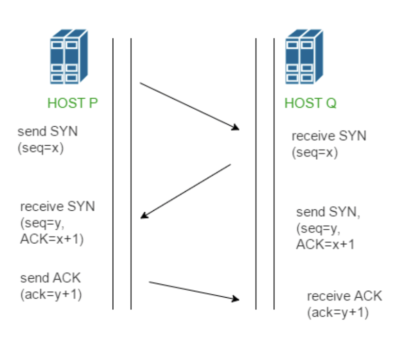
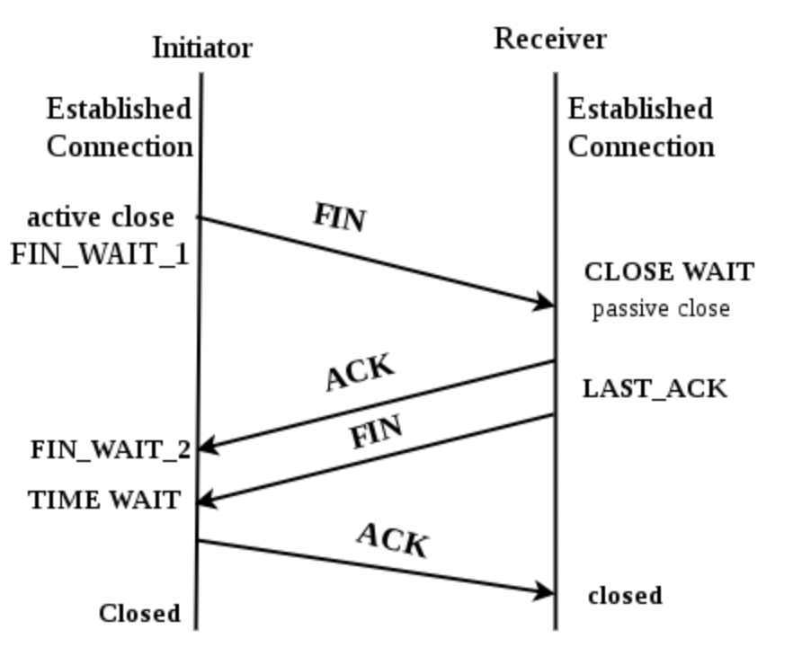

# 3 way handshake / 4 way handshake

TCP 프로토콜에서 통신 연결을 위한 접속에 3 way handshake를 사용하고 연결을 해제할 때 4 way handshake를 사용한다.

## 3 way handshake

[Tech interview](https://gyoogle.dev/blog/computer-science/network/TCP%203%20way%20handshake%20&%204%20way%20handshake.html)

TCP 통신을 설명하기 위해 PORT의 상태와 TCP 헤더의 flag 정보를 알아본다.

### PORT 상태

-   CLOSED: 포트가 닫힌 상태
-   LISTEN: 포트가 열린 상태, 연결 요청 대기 중
-   SYN_RCV: SYNC 요청을 받고 상대의 응답을 기다리는 중
-   ESTABLEISHED: 포트 연결 상태

### Flag 정보

-   SYN(Synchronize Sequence Number): 순서 번호를 랜덤으로 설정하여 세션을 연결하는 데 사용하며, 초기 SYN을 전송할 때 순서 번호를 함께 전송한다.
-   ACK(Acknowledgement): 응답 확인으로 패킷을 받았다는 것을 의미한다.
-   FIN(Finish): 연결 해제로 세션을 종료시킬 때 사용된다. 더 이상 전송할 데이터가 없다는 것을 의미한다.

### 3 way handshake의 동작

위 이미지에서 HOST P는 Client, HOST Q는 Server이다.

1. Server는 LISTEN 상태로 포트가 열려 있으며, 연결 요청을 대기 중이다.
2. Client가 연결을 요청하며 SYN과 seq(순서번호)를 Server에 전송한다.
3. Server는 SYN_RCV 상태가 되며, SYN과 ACK를 Client에게 전달한다. 이 때 seq+1을 ACK로 보내고, SYN에 새로운 seq를 전송한다.
4. 응답을 받은 Clinet의 상태는 ESTABLISHED가 되고 Server에 받은 seq+1을 전송한다.

이는 TCP 프로토콜의 전이중 연결 방식의 특징을 보여준다. 각 응답에 대한 ACK를 주고 받는다.

### 4 way handshake의 동작

Client와 Server의 연결을 해제 시키는 과정으로 FIN 플래그가 사용된다.

TCP 프로토콜에서 연결 해제를 Termination이라고 하며 두 가지 방식이 있다.

#### Graceful connection release(정상적이 연결 해제)

Client와 Server의 연결이 서로 닫힐 때 까지 연결이 유지된다.

#### Abrupt connection release(갑작스런 연결 해제)

하나의 TCP 개체가 연결을 강제로 닫는 경우와 한 사용자가 두 데이터 전송 방향을 모두 닫는 경우에 해당한다.

[Tech interview](https://gyoogle.dev/blog/computer-science/network/TCP%203%20way%20handshake%20&%204%20way%20handshake.html)

1. Client는 Server에 연결을 종료한다는 의미의 FIN 플래그를 전송한다. FIN 패킷에는 ACK가 포함되어 있다.
2. Server는 FIN을 받고 ACK를 Client로 전송한다. Server는 남은 데이터가 있으면 모두 전송한 다음 close()를 호출한다.
3. Client는 Server로 부터 ACK를 받고 FIN 패킷을 기다린다.
4. Server는 FIN 패킷을 Client에게 전송한 후 승인 번호를 보내줄 때까지 기다리는 LAST_ACK 상태로 들어간다.
5. Client는 Server로 부터 받은 FIN 패킷을 확인하고 ACK를 Server에 전송한다. Client는 Server로 부터 남은 데이터를 기다리는 TIME_WAIT에 들어가게 된다. TIME_WAIT은 의도치 않은 에러로 연결이 데드락으로 빠지는 것을 방지해 준다.
6. Server는 ACK를 받은 후 소켓을 종료 한다.
7. Client의 TIME_WAIT 시간이 끝나면 Client 소켓을 종료한다.
