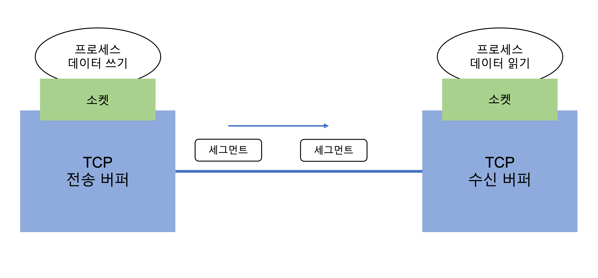
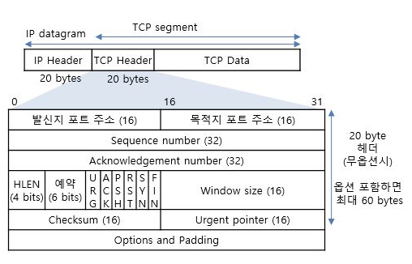
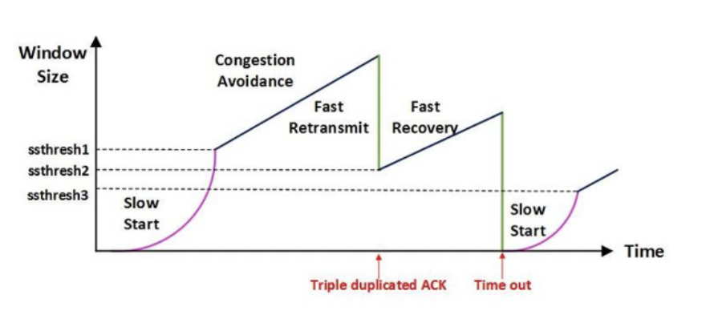

# TCP

# TCP 프로토콜

TCP는 스트림 기반 프로토콜로 바이트 스트림 형태로 데이터를 송수신 한다. TCP가 제공하는 서비스는 아래와 같다

-   전이중 통신(양방향 데이터 송수신)
-   다중화, 역다중화
-   연결지향 서비스
    -   두 TCP간에 가상 연결 설정
    -   양방향 데이터 교환
    -   연결 종료
-   신뢰성 서비스 -> 확인 응답 매커니즘 이용

TCP는 TCP헤더와 클라이언트 데이터를 하나로 만들어 TCP 세그먼트를 형성한다. 세그먼트는 네트워크 계층에 전달되며, 네트워크 계층 IP 데이터그램 안에 각각 캡슐화된다.

### Numbering System(번호화 시스템)

#### TCP Segment Header

[정보통신기술용어해설](http://www.ktword.co.kr/test/view/view.php?m_temp1=1889)

번호화 시스템은 모든 데이터에 바이트 번호를 부여한다. 송신 순서 번호와 확인 응답 번호를 가진다. 세그먼트에 있는 첫 번째 바이트에 송신 순서 번호를 할당하고, 확인 응답 번호는 자신이 수신하기를 기대하는 다음 바이트 번호이다. TCP segment의 Sequence number이다.

### Flow Control(흐름 제어)

흐름제어는 송신측과 수신측의 데이터 처리 속도 차이를 해결하기 위한 기법이다. 수신측에는 패킷을 수신 받는 버퍼의 크기가 정해져 있다. 송신측의 전송 속도가 빨라 수신측 버퍼에 패킷이 쌓이게 된다면 버퍼가 가득 차 손실되는 패킷이 발생한다. 수신측이 송신측에 자신의 상태를 계속 알리는 방식으로 흐름제어를 수행한다. 데이터를 더 받을 준비가 되었다는 상태를 송신측에 전달한 경우 송신측에서 패킷을 보내도록 동작한다.

흐름제어 기법에는 두 가지가 있다. Stop-and-Wait(정지-대기)와 Sliding-Window(슬라이딩 윈도우)기법이다.

#### Stop-and-Wait

정지-대기 기법은 말 그대로 매번 전송한 패키에 대해 응답을 받아야 다음 패킷을 전송할 수 있는 방법이다. 구조는 간단하지만 많은 데이터를 전송하기에 비효율적이다.

ARQ(검출 후 재전송)방식의 일종으로 송신측에서 1개의 프레임을 송신, 수신측에서 프레임 에러 유무를 판단하여 ACK나 NAK을 전송한다. 수신측으로 부터 NAK을 수신하거나, 일정 시간까지 ACK나 NAK을 수신하지 받지 못하면 에러로 간주하여 해당 프레임을 재전송한다.

#### Sliding Window

연속적 ARQ라고도 하며, 일정 윈도우 크기 이내에서 한번에 여러 패킷을 송신하고, 이들 패킷에 대하여 단지 한 번의 ACK로 수신을 확인한다. 수신측에서 설정한 윈도우 크기만큼 송신측에서 확인 응답 없이 세그먼트를 전송할 수 있게 하여 데이터 흐름을 동적으로 조절하는 기법이다.

### Error Control(오류 제어)

tcp 프로토콜은 통신 중 오류가 발생하면 데이터를 재전송한다. tcp 프로토콜은 ARQ(Automatic Repeat Request)를 사용해 오류제어를 한다.

#### stop and wait

오류제어에도 stop and wait 기법이 사용된다. stop and wait 기법은 데이터를 전송 후 ACK를 받고 다시 데이터를 전송하는 기법이다. 일정 시간이 지나도 ACK를 받지 못하면 데이터를 재전송한다.

#### Go Back N

연속적 ARQ라고도 하며 연속적으로 데이터를 보내고 오류가 발생한 지점부터 재전송 하는 방법이다. 일정 윈도우 크기 이내에서 한번에 여러 패킷을 송신하고, 이들 패킷에 대하여 단지 한 번의 ACK로 수신을 확인한다. 오류가 발생한 데이터부터 다시 재전송하기 때문에 성공한 데이터까지 다시 보내야 하므로 비효율적이다.

#### Selective Repeat

오류가 난 데이터만 재전송하는 방식이다. 오류가 발생한 데이터만 전송하는 부분에서 효율적일 수 있지만, 수신측의 버퍼 데이터가 순차적이지 않다는 단점이 있다.

### Congestion Control(혼잡 제어)

네트워크 내에 패킷의 수가 과도하게 증가하는 현상을 제어하는 기능을 혼잡제어라고 한다.

#### AIMD(Additive Increase / Mutipleicative Decrease)

[Tech Interview](https://gyoogle.dev/blog/computer-science/network/흐름제어%20&%20혼잡제어.html)

패킷을 하나씩 보내고 문제없이 도착하면 윈도우 크기를 1씩 증가시키며 전송하는 기법이다. 패킷 전송에 실패하거나 일정 시간을 넘어가게되면, 패킷 전송 속도를 절반으로 줄인다. 초기에 네트워크가 혼잡해 지는 상황을 미리 감지하지 못하는 단점이 있다. 네트워크가 혼잡해지면 대역폭을 줄이는 방식이다.

#### Slow Start

AIMD와 동일하게 패킷을 하나씩 보내면서 시작하고, 문제없이 도착하면 윈도우 크기를 1씩 늘려간다. 전송 속도는 지수 함수 형태로 증가한다. 네트워크에서 혼잡이 발생하면 윈도우 크기를 1로 떨어뜨린다.

초기 네트워크 수용량을 예상할 수 있는 정보가 없지만, 혼잡이 한번 발생하고 나면 네트워크 수용량을 예상할 수 있다. 혼잡이 발생한 윈도우 크기의 절반까지는 지수 함수 형태로 윈도우 크기를 증가 시키고 그 이후 부터는 1씩 증가시키는 특징을 가지고 있다.

#### Fast Retransmit

빠른 재전송은 TCP 프로토콜의 혼잡 제어에 추가된 정책으로 패킷을 받는 쪽에서 먼저 도착할 패킷이 도착하지 않고 다음 패킷이 도착한 경우에도 ACK 응답 패킷을 보내게 된다. 순서대로 잘 도착한 마지막 패킷의 순번을 ACK에 보내게 되고, 중간 패킷 하나가 손실되게 되면 송신측에서는 순번이 중복된 ACK 패킷을 받게 된다. 중복된 패킷임을 확인하게되면 문제가 되는 순번의 패킷을 재전송해준다. 이 과정에서 중복된 순버의 패킷 3개를 받게 되면 재전송을 하게된다. 또한 혼잡을 감지하고 윈도우 크기를 줄인다.

#### Fast Recovery

빠른 회복 기법은 혼잡 상태가 되면 윈도우 크기를 반으로 줄이고 선형 증가 시키는 방법이다. 이 방법은 혼잡 상황을 겪게되면 이후에는 AIMD 기법으로 동작하게 된다.
