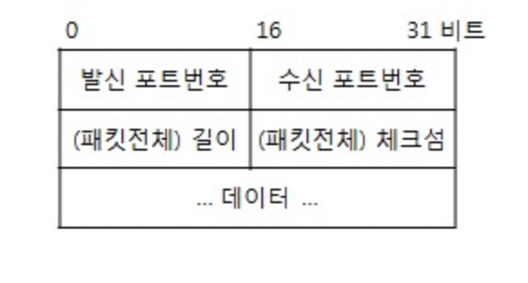

# UDP

> 가상회선: 패킷 교환망 에서 두 개 이상의 노드 간에 구성되는 가상의 종단간 연결

전송 계층의 통신 프로토콜 중 하나이다. TCP 프로토콜과 반대로 신뢰성이 낮고 안정성을 보장하지 않는다. 가상회선을 확립할 필요가 없고, 유연하며 실시간적 데이터 전송에 적합하다.

TCP 프토콜과 다르게 데이터 전송에 있어서 확인 응답, 순서 제어, 흐름 제어가 없다. checksum을 제외한 오류 검출 및 제어 기능이 없다. 연결 지향형인 TCP와 다르게 비연결성 특징을 갖는다. 핸드 쉐이킹이 없는 논리적인 가상회선 연결이 필요하지 않다.

[정보통신기술용어해설](http://www.ktword.co.kr/test/view/view.php?m_temp1=323)

데이터의 전송 단위는 메세지이다. 데이터 전송 시 UDP의 헤더는 8바이트 크기로 헤더 처리에 많은 시간을 들이지 않는다.
